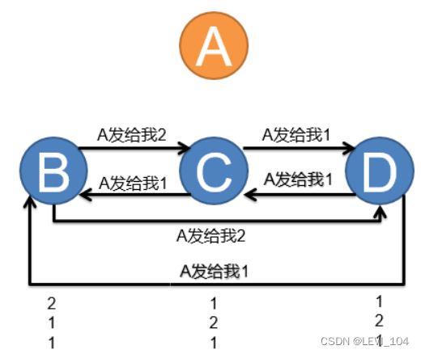

## **拜占庭问题&两军问题**

### 情景引入

拜占庭帝国想要进攻一个城市，为此派出了10个将军率领10支军队，这个城市足以抵御5支常规拜占庭军队的同时袭击。这10支军队不能集合在一起单点突破，必须在分开的包围状态下同时攻击，至少6支军队同时袭击才能攻下敌国。10支军队分散在敌国的四周，依靠通信兵相互通信来协商进攻意向及进攻时间。这里的问题是，将军中可能会有叛徒，忠诚的将军希望达成命令的一致（比如约定某个时间一起进攻），但背叛的将军会通过发送错误的消息阻挠忠诚的将军达成命令上的一致。在这种状态下，拜占庭将军们能否找到一种分布式的协议来让他们能够远程协商，从而赢取战斗？

> 当前研究的结论是：如果叛徒的数量大于或等于1/3，拜占庭问题不可解。

### 分析过程

先看4个将军A、B、C、D的情况：假设4个将军中最多只有1个背叛者。如果超过一半的将军，即3个将军去进攻，能取得胜利。

**情况（1）**：无人造假，但不参与战斗情况：假设A将军分别告诉B、C、D将军，下午1点发起进攻。假设A、B、C、D中有一人是叛徒。那么，到了下午1点，将有三个将军发起进攻，一个不为所动，他们能发现发现没有参与进攻的将军是叛徒。在这种情况中，对任务执行没有影响。

**情况（2）**：假设B、C、D中的B是叛徒。在A告诉B、C、D下午1点进攻时，B、C、D三人之间会有一次信息交互，它们会分别把自己收到的信息告诉给另外两人。此时不管B发出的时间是多少，C和D两人之中都会得到至少两个是1点的消息：

图8 

 

 图9

B：【1或？点（来自A），1点 （来自C），1点（来自D）】

C：【1点（来自A）   ， ？点（来自B），1点（来自D）】

D：【1点（来自A）    ，？点（来自B），1点（来自C）】

这种情况下，1点是占多数的信息。对于C和D而言，此时不能判断谁是叛徒（如果A是叛徒，发给C和D 1点，而发给B ？点）。但是不管怎么样，C和D都能放心执行1点进攻的命令。

- 对于C和D而言，如果A是叛徒，那么B会收到来自C和D的两条1点进攻的消息，所以B、C和D都会在1点发起进攻；忠诚的将军获胜；
- 对于C和D而言，如果B是叛徒，那么A、C和D将会同时在1点发起进攻；忠诚的将军获胜。

**情况（3）**：假设如果A是背叛的。A分别告诉B、C、D将军在下午1点、2点、3点发起进攻。于是，到了下午，B、C、D三个将军分别去进攻，都失败了。这种情况下，对任务是毁灭性打击。

A是背叛者的情况，在A告诉B、C、D三个不同的时间之后，B、C、D三人之间会有一次信息交互，它们会分别把自己收到的信息告诉给另外两人：

图10

B：【1点（来自A），2点（来自C），3点（来自D）】

C：【1点（来自B），2点（来自A），3点（来自D）】

D：【1点（来自B），2点（来自C），3点（来自A）】

这就知道A是叛徒

**对于3个将军的情况**，3个将军A、B、C，其中一人是叛徒。

假设将军A发出进攻命令“下午1点进攻”，B或C其中一人是叛徒。假设B是叛徒，他可能告诉C，他收到的是“下午两点进攻”的命令。这时C收到一个“下午一点进攻”，一个“下午两点进攻“，因此C不能判断谁是叛徒，也不能判断真正的进攻时间。

另一种情况是，如果A是叛徒，告诉B“在下午1点进攻”，告诉C“在下午2点进攻”。当B告诉C，他收到“在下午1点进攻”的命令时，C收到的是“在下午两点进攻”的命令，同样无法判断进攻的时间和真正的叛徒。 从上面的例子可以看出，在只有三个将军的系统中，只要有一个是叛徒，也即1/3，拜占庭问题便不可解。

### 区块链中的拜占庭问题

区块链中的各个节点====>将军，信息传递====>打仗时间

然而，拜占庭问题主要对应：所有传递的信息都是口头消息。口头消息和书写消息的不同是，消息的接收方无法判断消息的正确性。例如，在B是叛徒的情况下，即使A告诉B要“下午1点进攻”，B可以篡改消息成“A告诉我要下午2点进攻”。此时C和D无法判断到底是A还是B在撒谎。

然而，在区块链中，可以采用书写的形式来传递信息，从而解决了拜占庭问题。在这里，书写意味着A可以使用特殊的笔迹或者在命令上加盖自己的印章，而笔迹或者印章是不可伪造的。那么问题可以简化为A将军用写下的“下午1点进攻”消息，加盖印章，然后传给B，因为有印章，所以B无法篡改A的消息，同时在纸上加盖自己的印章，然后把这张纸传给C，C也加盖印章表示同意，然后D也加盖印章，最后加盖了4个印章的纸再传给没人看一遍，就可以让所有节点一致了。这使得问题大大简化，但采用书面消息的前提是：每个将军都知道其他将军的笔迹或印章，并且笔迹或印章无法被模仿，其他将军也容易进行认证；在一次通信中，各个将军是顺序签名的，如果所有的将军同时发消息，那么消息量会大大增加。

### 区块链用签名书写的方式解决拜占庭问题

相当于每个将军配备一台电脑（相当于分布式的节点），降低了信息流通成本，让信息可以及时地同步到各位将军。而**每个人都有一对公私钥，使用私钥进行签名，其他用户使用公钥进行认证。**也即，从理论而言，区块链是可以以书写的的方法达到一致性。

使用区块链语言描述：当一个矿工打包出一个区块之后，其他节点会对这个区块进行验证。如果验证通过，则表明已经有节点发布新区块成功，自己就不再竞争当前区块打包，而是选择接受这个区块，记录到自己的账本中，然后进行下一个区块的竞争。网络中只有最快解谜的区块，才会添加的账本中，其他的节点进行复制，这样就保证了整个账本的唯一性。

假如打包的节点有任何的作弊行为，都会导致网络的节点验证不通过，直接丢弃其打包的区块，这个区块就无法记录到总账本中，作弊的节点耗费的成本就白费了，因此在巨大的挖矿成本下，也使得矿工自觉自愿的遵守比特币系统的共识协议，也就确保了整个系统的安全。

工作量证明其实相当于提高了做叛徒（发布虚假区块）的成本，在工作量证明下，只有第一个完成证明的节点才能广播区块，竞争难度非常大，需要很高的算力，如果不成功其算力就白白的耗费了（算力是需要成本的），如果有这样的算力作为诚实的节点，同样也可以获得很大的收益（这就是矿工所作的工作），这也实际就不会有做叛徒的动机，整个比特币系统也因此而更稳定。

### 引申：两军问题

图11 

蓝军（B）驻扎在山谷之中，红军分两部分驻扎在山谷两旁（A1, A2）。A1和A2需要同时进攻才能击败蓝军。

为了约定共同进攻的时间，A1派出通信兵将攻击时间传达给A2，但通信兵需要穿过山谷才能将攻击时间传达给A2。而这个过程中，通信兵极有可能被蓝军截获从而导致A2不知道A1的进攻时间，于是A1不能确定进攻时间。

如果A2收到了进攻时间，为了和A1确定，A2在收到A1的信息之后也派出通信兵将自己受到的消息传给A1。然而，A2的通信兵同样可能被拦截。于是A2也也不确定A1是否知道自己的进攻时间。

A1收到A2的消息，可以发出第三条消息，对A2做确认或者发现消息被篡改。

但是，这又开始新的不确定过程，从而形成了无限循环，双方永远不能对进攻时间达成一致。

这个问题类似TCP协议中的握手问题。A、B之间不断发送请求确认，而请求可能缺失或修改

图12 
