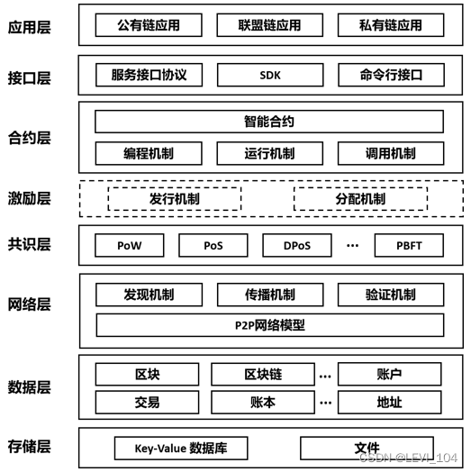

# 区块链概述

# 区块链概念认知

一个视频可视化区块链：https://www.youtube.com/watch?v=TVlo66aOZE0

区块链：是基于密码学和共识机制等技术创建与存储庞大交易资料区块链的**点对点网络系统。**

 图1：区块链系统逻辑架构

# **一些概述**

- 它作为一个去 中心化 的分布式账本， 其本身是一系列使用密码学而产生的具有互相关了的数据块。
- 区块链实质是一个不断增长的分布式结算数据库，使用算法证明机制来解决信息系统中的信任危机。
- 区块链的运行及分布式数据存储和点对点传输，且需要共识机制、加密算法（哈希，非对称加密） 等计算机技术来辅助记录数。
- 技术基础：去中心化和信用共识
- 区块链的实质：一个不断增长的分布式结算数据库
- 一些特点 
  - 去中心化
  - 去中介化
  - 信息透明
  - 无法篡改
  - 网络分散：区块链网络，完全没有中央服务器和控制中心。由网络自己做出决定，从而控制自己。
  - 可追溯性：区块链是一个分散的数据库，分散数据库记录了区块链每笔交易的输入输出，从而可以 轻松的追踪资产数量变化和交易活动。
  - 共识机制：是区块链事务达成分散式共识的算法。区块链的节点是分散的，是没有做出决策的中心化权威机构。网络中保存数据的所有节点，必须汇集在一起共同决策，共识机制，决定了区块链数据库的真实性。
  - 安全性：区块链采用分散式数据库，利用散列和算法保障数据安全，安全性是在网络中集体创建的， 没有任何一方需要负责安全，安全性由参与者共同授予。基于去中心化 P2P 网络技术，区块链系统中所有参与节点将共同完成数 据的存储、维护，可 有效避免中心化数据系统遭到攻击时数据泄露的风险。
  - 高可用性：24*7 全天运行，无权限限制，内容无法篡改，何人何时何地均可使用。
  - 不可变性：任何放入区块链的信息，都会永远存在区块链上，不会消失。
  - 自动化性：智能合约是一种可编程化的数字协议，当合约参与方满足触发条件后， 合约条款将自动执行。智能合约的加入，为区块链带来了新的契机，保障部署在区块链上的合同条款可以实现自动、去中心化的计算，从而为诸多领域（尤其针对流程复杂繁琐、效率低下的领域）的效率提升、成本控制起到 不可忽视的作用。

