# 数字证书

（1）鲍勃有两把钥匙：一把是公钥，一把是私钥

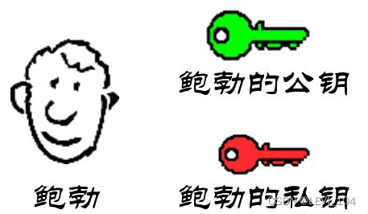

（2）鲍勃把公钥送给了他的朋友：帕蒂，道格，苏珊

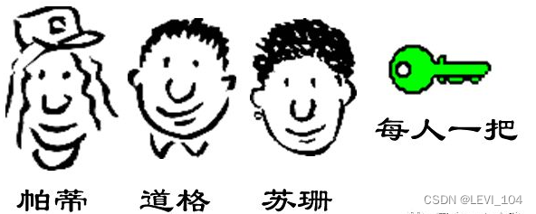

 （3）苏珊要给鲍勃写一封保密的信。她写完后用鲍勃的公钥加密，就可以达到保密效果

 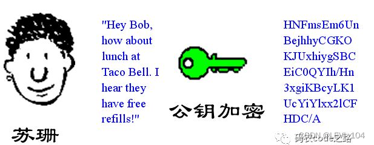编辑

 （4）鲍勃收到信后，用私钥解密，就看到信件的内容。这里要强调的是，只要鲍勃的私钥不泄露，这封信就是安全的，即使落在别人手里，也无法解密

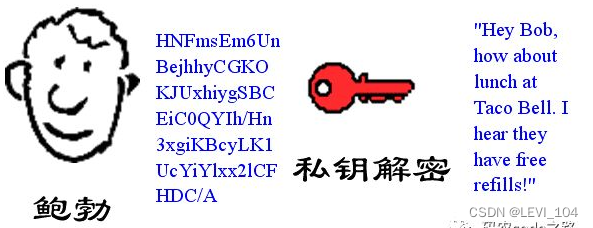

（5）鲍勃给苏珊回信，决定采用“数字签名”。他写完后，先用Hash函数，生成信件的摘要（digest)

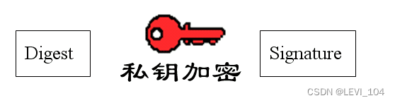

 （6）鲍勃将这个签名，附在信件下面，一起发给苏珊

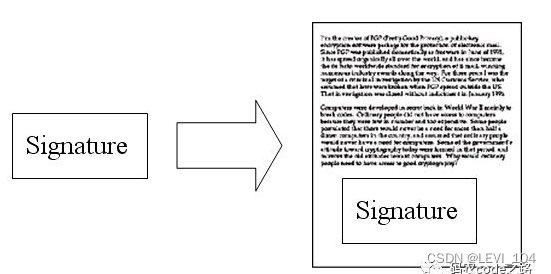

 （7）苏珊收到信后，取下数字签名，用鲍勃的公钥解密，得到信件的摘要。由此证明，这封信确实是鲍勃发出的

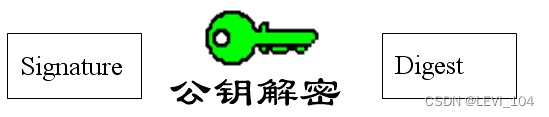

 （8）苏珊再对信件本身使用Hash函数，将得到的结果，与上一步得到的摘要进行对比。如果两者一致，就证明这封信没被修改过

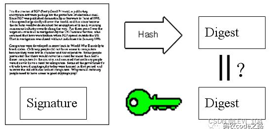

（9）复杂的情况出现了：道格想要欺骗苏珊，他偷偷地使用了苏珊的电脑，用自己的公钥换走了鲍勃的公钥。此时，苏珊实际上拥有的是道格的公钥，但是她还认为这是鲍勃的公钥。因此，道格可以冒充鲍勃，用自己的私钥做成“数字签名”，发信给苏珊，让苏珊用假的鲍勃公钥进行解密

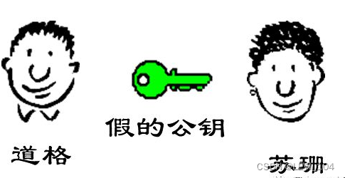

（10）后来，苏珊感觉不对劲，发现自己无法确定公钥是否真的属于鲍勃。她想到了一个办法，要求鲍勃去找“证书中心CA”，为公钥做认证。证书中心用自己的私钥，对鲍勃的公钥和一些相关信息一起加密，生成“数字证书” 

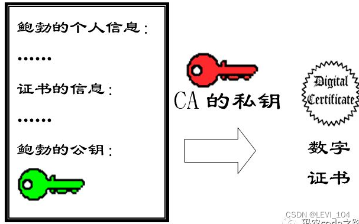

（11）鲍勃拿到数字证书后，就可以放心了。以后再给苏珊写信，只要在签名的同时，附上数字证书就可以了 

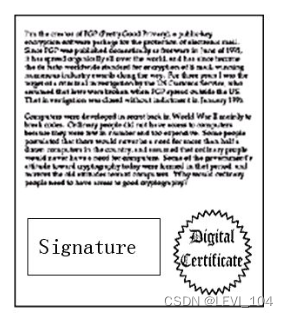

 （12）苏珊收到信后，用CA的公钥解开数字证书，就可以拿到鲍勃真实的公钥了，然后就可以证明“数字签名”是否真的属于鲍勃

详细了解数字证书，查看维基百科：[https://zh.wikipedia.org/wiki/%E5%85%AC%E9%96%8B%E9%87%91%E9%91%B0%E8%AA%8D%E8%AD%89](